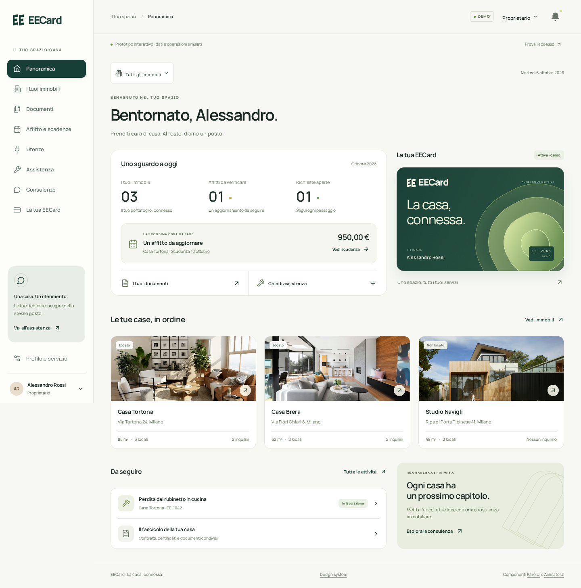

# EECard

EECard è un nome provvisorio; il prodotto evolve verso un’identità autonoma dall’agenzia Enrico Erca (ƎE). Il simbolo **C — Legame** è stato scelto e integrato; il nome resta aperto. [Guida e asset](docs/design/MARCHIO.md) · [Scarica SVG e favicon](https://eecard-design-preview.uepacio.chatgpt.site/brand/legame-assets.zip).

Prototipo di design desktop e smartphone per organizzare immobili, documenti, locazioni e assistenza. Tutti i dati e i servizi sono dimostrativi.



## Anteprima

**Online, con link separati:** [Desktop](https://eecard-design-preview.uepacio.chatgpt.site/desktop/) · [Mobile](https://eecard-design-preview.uepacio.chatgpt.site/mobile/). Accessibili senza account, con soli dati demo. [Dettagli e aggiornamento](docs/design/ANTEPRIME_WEB.md).

**Senza installare nulla:** scarica [docs/design/anteprima.html](docs/design/anteprima.html) e aprilo in Chrome, Safari o Edge. È un file autonomo con codice, font, fotografie e facsimile incorporati. GitHub mostra il sorgente: usa Download raw file, poi apri il file scaricato.

**Con server locale:**

```bash
npm ci
npm run dev
```

Apri http://localhost:5173. Richiede Node.js 22.12+ o 24 LTS. Per la build:

```bash
npm run build
npm run preview
```

`npm run preview:portable` rigenera l’HTML autonomo dalla build corrente. L’anteprima non richiede account, servizi esterni o chiavi API. Lo stato è salvato nel browser; Profilo → Ripristina tutta la demo riporta i dati iniziali.

## Cosa provare

- **Documenti:** apri il contratto, condividi con una parte autorizzata, scegli la durata, poi revoca.
- **Affitto:** passa a Inquilino, allega una prova demo e dichiara importo/data. Passa ad Agenzia → Incassi, inserisci una fonte demo e verifica. La quietanza resta un passaggio separato.
- **Assistenza:** crea una richiesta, prova l’errore di invio e riprova. Passa ad Agenzia, assegna il tecnico; passa a Tecnico per accettare e concludere.
- **Card:** blocca e sostituisci. Il precedente identificativo resta revocato.
- **Accesso:** Prova l’accesso → invito → codice demo `123456` → attivazione simulata.
- **Profilo:** laboratorio con nomi lunghi, 0/1/1.284 documenti, caricamento, errore, revoca e fine contratto.

Su mobile usa il menu **Altro** per affitto, immobili, consulenze e profilo. La persona Giulia Rossi dimostra una comproprietà su un immobile e una locazione come inquilina su un altro. L’agenzia ha un account demo distinto, senza impersonare i clienti.

## Verifiche

```bash
npx playwright install chromium
npm test
npm run format:check
```

Test end-to-end, axe-core, dimensioni 360/390/1280/1440 px, stress a 320 px, testo al 200%, tastiera, focus, movimento ridotto, file non validi, errori recuperabili, persistenza e permessi della demo. Risultati e limiti in [VERIFICHE.md](docs/design/VERIFICHE.md). `node scripts/audit.mjs` aggiorna il report axe; `node scripts/screenshots.mjs` rigenera le schermate (server locale avviato).

## Documentazione

Per riprendere in una nuova sessione partire dal [punto di ripresa](docs/progetto/PROSSIMA_SESSIONE.md). La base del prototipo è nella PR #2, integrata. Il simbolo Legame, l’identità calda e le correzioni di usabilità sono nella [PR #3](https://github.com/av3rgfx/EECard/pull/3), integrata. La direzione successiva combina Materia e luce con pagine aperte come Editoriale: tessera prima in home, riepiloghi immobili compatti quando sono più di uno, vista espansa nella pagina immobili e affitto in quattro passaggi visivi. La [PR #4](https://github.com/av3rgfx/EECard/pull/4) è stata integrata il 7 ottobre alle 22:13:57 UTC; le anteprime documentate sono Sites v5. Il naming resta aperto.

L'8 ottobre è stata analizzata la nuova conversazione dei fondatori del 7 ottobre:
[rapporto, contesto e prompt](docs/progetto/discussione-2026-10-07/README.md), con
30 punti EA01-EA30. Il lavoro è documentale, sul branch `docs/discussione-2026-10-07`,
senza nuove funzioni o deploy. Terminale al banco, wallet, partner, domotica e
assistente sono input da progettare; prezzi e perimetro restano aperti.

- [Brief storico del confronto, ora eseguito](docs/progetto/PROMPT_DESIGN.md)
- [Analisi del design e migliorie proposte](docs/design/REVISIONE_VISIVA.md)
- [Prodotto, persone e confini](PRODUCT.md)
- [Guida al design](DESIGN.md)
- [Sviluppo, architettura del prototipo e manutenzione](DEVELOPMENT.md)
- [Backlog e priorità proposte](docs/progetto/BACKLOG.md)
- [Registro delle sessioni](docs/progetto/SESSIONI.md)

- [Mappa delle schermate e dei percorsi](docs/design/PERCORSI.md)
- [Design system e token](docs/design/DESIGN_SYSTEM.md)
- [Decisioni confermate, proposte e questioni aperte](docs/design/DECISIONI.md)
- [Fonti, skill, versioni e licenze](docs/design/FONTI.md)
- [Verifiche, correzioni e prove su telefono](docs/design/VERIFICHE.md)
- [Studio preliminare v0.1](docs/progetto/EECard-studio-v0.1.pdf)
- [Contesto e prossima sessione](docs/progetto/PROSSIMA_SESSIONE.md)

## Confine del lavoro

Frontend di presentazione, non prodotto operativo. Nessun pagamento, documento valido, ordine di card o prenotazione reale. I file non vengono caricati su un server. Prezzi, inclusioni, zona, copertura, budget e primo rilascio restano aperti. Anche pagamenti integrati, app negli store, 3D e AI restano da valutare.

Componenti adattati da [Animate UI](https://animate-ui.com) e [Rare UI](https://rareui.com). Licenze e attribuzioni conservate in `docs/design/`. Il prototipo non redistribuisce un catalogo di componenti.
